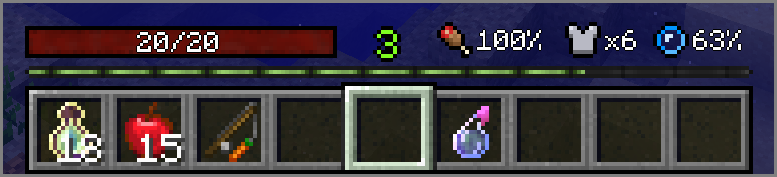

### What is Ex HUD?

Ex HUD is a client-side Minecraft mod created with the Fabric modding framework to be a standalone implementation of the HUD that featured in legacy releases of [PlayerEx](https://github.com/CleverNucleus/PlayerEx).

### Content

Ex HUD changes how the player's health, armour, food, air and experience bars look in favour of a more RPG-themed minimalist style. 

The health bar (left) can be disabled, as can the utilities bar (right). 

When holding a food item, the food percentage will blink and display the value that the player would have after consuming the food item, similar to AppleSkin. This feature can also be disabled through the config.

### FAQ

- *FoRgE pLeAsE ?*
  - No, but feel free to port yourself.
- Backport to *x* version?
  - No.
- Can you add display elements from *x* mod?
  - Maybe, make an issue [here](https://github.com/CleverNucleus/Ex-HUD/issues). Note that for AppleSkin, I am only going as far as food/hunger values, which is already implemented. I won't be adding support for saturation display.
